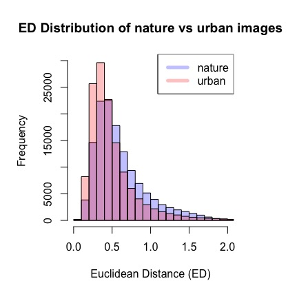

# Replication Materials

Author: Yutai Li

The code and data in this repository are used to analyze the low-level visual features and the high-level semantic information of natural and urban images from the MIT SUN Database ([link to the image dataset](https://github.com/yutaili/Data/tree/main/dataset))). The code of plotting the principal component analysis (PCA) and calculating the Eculidean Distance between low-level features are written in R. The semantic analysis code is written in python, and the implementation of Google Vision API is through Google Colab. The required python library is specified in the *requirement.txt* file in this repository. The descriptions of file in this document are as follows:

## Supplemental Code: Example

The code and data in this repository is an example of a reproducible research workflow for MACS 30200 "Perspectives on Computational Research" at the University of Chicago.

The code is written in Python 3.9.7 and all of its dependencies can be installed by running the following in the terminal (with the `requirements.txt` file included in this repository):

```
pip install -r requirements.txt
```

## File Descriptions:

**MIT_ImageRatings.csv**: low-level visual feature data on 1030 images from Berman et al.(2014) study [link to full image dataset](https://github.com/yutaili/Data/tree/main/dataset)<br />
**raw_url.csv**: public accessible urls of images from the dataset.<br />
**image_label.csv**: image with labels from the Google Vision API label detection algorithm.<br />
**Get_Labels.ipynb**: Google Colab notebook that implements the Google Vision API. A Google Cloud Platform account and a service key is needed to implement the Vision API.<br />
**semantic analysis.ipynb**: A python3 notebook that calculate the semantic distances from image labels. (not finished yet)<br />
**resmemAnalysis.R**: R script that plot the principal component analysis to visualize the distribution of images in 2D plot. The Eculidean distances between images and a two-sample t-test are calculated based on the image vectors.<br />


To replicate the findings from this project, one can downloaded the _MIT_ImageRatings.csv_ file and import it to RStudio. Then, one can use the code in _resmemAnalysis.R_ to replicate the findings in the low-level visual feature part. For high-level semantic information, a Google Cloud Platform with payment method established and a service key are needed to implement the Google Vision API ([detailed instruction here](https://codelabs.developers.google.com/codelabs/cloud-vision-api-python#6)). Or, one can use the current data from the _image_label.csv_, which contains the image file name and its associate labels and run them in the _semantic analysis.ipynb_ file. 

## Initial Finding

### Low-Level Visual Features

To analyze the similarities of low-level features in every images, I transfer every image into a 9-dimension vector that represents the 9 low-level features of one image. From the PCA plot, we can see that the distribution of natural images and urban images are relatively separated. <br> <br> Then, I made two Eculidean distance matrices of natural images and urban images, which contains all the Eculidean distances between every two images. From the unscaled histogram of Eculidean distances, we can see the average distance between urban images is smaller than the natural images (Two-Sample t-test: t = 88.627, df = 261680, p-value < 2.2e-16). However, after scaling the distances, the difference in mean is no longer significant (Two-Sample t-test: t = -0.64146, df = 264693, p-value = 0.5212). The plots are as follows:


, 

### High-Level Semantic Information 


```python

```
